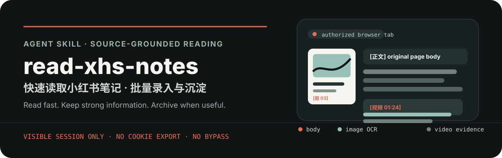
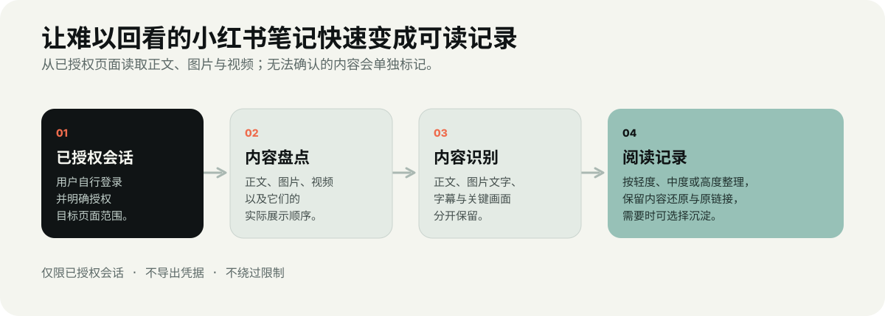

<p align="center">
  
</p>

<p align="center">
  <a href="#安装"><strong>安装</strong></a> ·
  <a href="#第一次使用"><strong>第一次使用</strong></a> ·
  <a href="#整理深度"><strong>整理深度</strong></a> ·
  <a href="#批量入口"><strong>批量入口</strong></a> ·
  <a href="#内容沉淀"><strong>内容沉淀</strong></a> ·
  <a href="#登录态与隐私"><strong>登录态与隐私</strong></a>
</p>

`read-xhs-notes` 是一个面向 Codex、Claude Code 等兼容 Agent Skills 工具的小红书**快速阅读与批量阅读** Skill。

它会读取笔记正文、图片文字和可访问的视频内容，整理成一份容易浏览、能够回到原笔记核对、也可以继续沉淀的阅读记录。无论笔记讨论 AI、旅行、商品经验还是其他主题，整理方式都跟随原笔记内容，不套用固定的信息清单，也不会把内容简单压缩成几句话。

<p align="center">
  
</p>

## 安装

本仓库遵循通用 Agent Skills 目录约定，`npx skills` 可发现并安装其中的 `read-xhs-notes`。

```bash
# 安装到当前项目，供 Codex 使用
npx skills add shrekcg/read-xhs-notes --skill read-xhs-notes -a codex

# 全局安装到 Codex，跳过交互确认
npx skills add shrekcg/read-xhs-notes --skill read-xhs-notes -g -a codex -y

# 安装到 Claude Code（同一份 Skill）
npx skills add shrekcg/read-xhs-notes --skill read-xhs-notes -g -a claude-code -y
```

也可以克隆仓库，再将 [`skills/read-xhs-notes`](./skills/read-xhs-notes) 放入 Agent 能够识别的 skills 目录。不同 Agent 连接浏览器的方式可能不同；本 Skill 只要求 Agent 能读取用户已经授权的可见浏览器标签页，不限定浏览器品牌。

## 第一次使用

第一次使用时，用户需要在自己的浏览器中完成登录。只要同一浏览器会话仍然有效，Agent 就可以在明确授权的范围内读取单篇笔记、收藏或喜欢列表。平台撤销会话、浏览器资料目录被重建或触发设备验证后，用户需要重新登录。

1. 在 Agent 可以连接的可见浏览器中打开小红书。
2. 用户自行完成登录、设备验证或验证码。
3. 打开或明确分享目标笔记、收藏页或喜欢页。
4. 直接发出请求，例如：

```text
用 $read-xhs-notes 快速阅读这条小红书笔记，整理=中度，原文=附上，缓存=即刻清理。

用 $read-xhs-notes 批量读取我“我的收藏”里最新 5 篇笔记。先按屏幕上的瀑布流顺序列出标题，再逐篇输出阅读记录；整理=中度，模型=继承，推理=中，不保存。

用 $read-xhs-notes 批量读取我“喜欢”里的最新 10 篇笔记，整理=高度，沉淀=本地CSV+Markdown，输出目录=~/Documents/xhs-library。

用 $read-xhs-notes 读取这条视频笔记，整理=轻度。优先给出字幕/口播和画面里的操作；无法完整转写时，请标出已覆盖时间段和原因。
```

`入口`、`数量`、`模型`、`推理`、`整理`、`原文`、`沉淀`、`输出目录` 和 `缓存` 可以独立组合。若宿主支持子 Agent 与模型选择，阅读分析阶段只接收脱敏后的内容证据包，不接收浏览器会话或凭据。

## 默认策略

用户没有指定参数时，Skill 会先根据输入判断入口，再采用以下默认策略。它不会自行进入收藏、喜欢或其他私有列表；只有用户明确指定“收藏”“喜欢”，或提供已经授权的对应页面时，才会读取这些入口。

| 项目 | 默认值 | 含义 |
| --- | --- | --- |
| 入口 | `按用户输入识别` | 单链接读一篇；一组链接逐篇读；收藏、喜欢和可见卡片必须由用户明确指定。 |
| 模型 | `继承当前对话模型` | 如果宿主支持子 Agent，分析阶段使用与当前对话相同的模型；不支持时由当前 Agent 直接完成。 |
| 推理 | `继承当前对话推理强度` | 不会暗中改成更高或更低档。用户可用 `推理=低/中/高` 覆盖。 |
| 整理 | `中度` | 讲清内容、展开方式和主题相关重点，并保留可对照的内容还原。 |
| 原文 | `自动` | 正文、图片文字稿和视频文字稿在篇幅可承载时附上；过长时说明范围，并在用户要求时输出为单独文件。 |
| 沉淀 | `不保存` | 默认不写入本地或飞书，避免无意产生外部文档。 |
| 缓存 | `即刻清理` | 本次用到的媒体与中间文件完成核对后清理。 |

例如，只说“帮我整理这个链接”时，实际采用的是：`入口=链接 模型=继承 推理=继承 整理=中度 原文=自动 沉淀=不保存 缓存=即刻清理`。如果说“整理我收藏最新 10 篇”，只会把入口和数量改为 `入口=收藏 数量=10`，其余默认值保持不变。需要自动沉淀到飞书时，请明确加上 `沉淀=飞书文档`；如果没有指定目标位置，Skill 会在飞书个人空间新建一份本次阅读文档。

## 整理深度

整理深度控制阅读时关注的范围和结构化程度，不等于单纯缩短篇幅。默认使用 `中度`。每一档都会保留“内容还原”，方便与整理结果对照。

| 整理深度 | 适合什么情况 | 结果会怎样 |
| --- | --- | --- |
| `轻度` | 想几乎按原文读，只希望更容易扫读 | 最小分段与衔接，尽量保留顺序、细节、例子、条件和原有表达。 |
| `中度` | 日常读一篇笔记、回顾一小批收藏 | 讲清笔记在说什么、如何展开、结论是什么；把主题相关的关键细节整理出来。 |
| `高度` | 批量初筛，判断哪些值得回到原文细读 | 用更清晰层次突出观点、步骤、条件、风险和值得回看的点，同时保留内容还原。 |

关注重点会随笔记内容变化：AI 或工具笔记会留意工具名、版本、提示词、命令、工作流和限制；旅行笔记会留意地点、路线、时间、费用、预约和避坑信息；商品或经验笔记会留意适用对象、方法、前提、结果和例外。这些只是阅读提示，不会成为每篇笔记都必须填写的栏目。

## 标准输出

每篇笔记默认给出：

1. 标题、类型、来源入口和整理深度。
2. 干净的原链接，方便回到原笔记。
3. 内容：按所选深度说明笔记主要在说什么、如何表达和重要细节。
4. 内容还原：按正文、图片、视频的原始顺序保留可核对内容，必要时标记 `[正文]`、`[图 2]`、`[视频 01:24]`。
5. 原始文本：按设置附上正文、图片文字稿和视频文字稿。
6. 读取状态：明确区分“已读取”“部分读取”“登录失效”“访问受限”和“页面异常”。
7. 识别说明：仅在内容已读取但有问题时出现，准确说明哪部分未读到、存疑或无法读取，以及原因。

### 识别有问题时怎么办

Skill 不会用猜测填补空缺，而会明确说明问题：

```text
识别说明
- 状态：部分识别
- 影响范围：[图 4] 的两行小字；视频 00:42–01:18 的口播
- 原因：图片模糊 / 字幕不可访问 / 音轨不可用 / 多处证据冲突
- 处理：已保留确认内容；未确认部分未纳入结论
```

根据这些信息，你可以决定直接查看原笔记，或让 Agent 重新读取某张图片、某段视频。

### 登录失效与读取状态

`覆盖度`只描述已经进入笔记后的内容覆盖范围，不能拿来掩盖“根本没有读到笔记”的错误。Skill 会先检查是否在实际笔记内容区域取得了正文或媒体；如果页面以登录/扫码/验证码表单为主，且没有取得笔记主体，就判为`登录失效`，不把页面标题、推荐卡片或话题标签当作笔记内容。

| 读取状态 | 覆盖度 | 内容概览 | 含义与下一步 |
| --- | --- | --- | --- |
| `已读取` | 完整 | 有 | 主体内容和可访问媒体均已读取。 |
| `部分读取` | 部分 | 有 | 已取得主体，但部分图片、字幕、音频或关键画面不可读。 |
| `登录失效` | 不适用 | 留空 | 暂停读取，提示用户重新在当前 Agent 可访问的浏览器中登录。 |
| `访问受限` | 不适用 | 留空 | 遇到验证码、频率限制、权限限制或页面要求人工操作；不绕过。 |
| `页面异常` | 不适用 | 留空 | 页面加载、结构识别或媒体请求异常；可让用户刷新后重试。 |

检测到登录失效后，Skill 会主动把目标笔记的登录页打开并保留在可见的浏览器面板中，同时暂停当前任务。用户只需在面板中使用小红书或微信扫码，或者输入手机号并完成验证码、设备验证；完成后回到对话回复“已登录”。Agent 收到确认后，会从同一链接继续读取，并更新本次输出或沉淀表格。整个过程不需要提供 Cookie、Token、登录缓存 key 或浏览器 Profile。

如果看不到登录页，请先展开工作台中的浏览器面板。Agent 应说明当前页面标题和可用的登录方式，不能只给出“请重新登录”这一句提示。用户不需要重新复制链接、寻找登录入口，也不要把验证码或登录信息发送给 Agent。

如果页面显示“安全限制”“账号异常”“请稍后重试”或小红书的错误码（例如 `300011`），这不是普通的登录失效，而是 `访问受限`：停止连续重试，由用户在本人设备或小红书 App 中完成账号安全检查、等待限制解除或按平台提示处理。确认可以正常打开任意笔记后，再告诉 Agent“访问已恢复，重试刚才的链接”。Skill 不会绕过验证、限制或安全页。

### 更持久的登录态

登录态由两个条件共同决定：浏览器是否继续使用原来的本地资料目录，以及小红书服务端是否仍然认可这次会话。分享链接中的 `xsec_token` 等参数只是访问参数，不等于账号登录态；短链接失效和账号退出需要分别判断。

临时或任务级浏览器适合快速验证，但宿主重启、任务切换或新建隔离实例后，登录态可能不会继承。长期每天使用时，推荐配置一个**本机专用、可见、持久化的浏览器资料目录**：首次由用户正常登录，后续始终连接同一实例与同一资料目录。浏览器负责保存自己的会话数据，Skill 只操作可见页面，不读取、导出或记录 Cookie、Token 和 Profile 内容。

这套方案可以把“每次任务都登录”减少为“平台撤销会话或要求安全验证时再登录”，但不能保证永久有效。为减少不必要的失效，建议避免同时在多个网页端会话登录同一账号；移动端正常使用不应被 Skill 视为新的网页会话。再次出现登录页时，仍按上面的可见交接流程恢复，不会自动重放凭据。

## 批量入口

批量阅读可以从不同入口开始：

| 入口 | 用途 | 已验证页面状态 |
| --- | --- | --- |
| `入口=收藏` | 批量读取用户收藏的笔记 | `tab=fav&subTab=note` |
| `入口=喜欢` | 批量读取用户“点赞”列表中的笔记 | `tab=liked&subTab=note`；已验证能取得 `pc_like` 笔记卡片 |
| `入口=链接列表` | 批量读取用户粘贴的一组链接 | 不依赖个人列表 |
| `入口=可见卡片` | 读取当前已授权页面已渲染的卡片 | 用户手动筛选后交给 Agent |

收藏和喜欢必须分别确认当前选中的“笔记”子视图。卡片按**卡片容器的屏幕位置**排序：先上后下、同一行先左后右；不能使用 DOM 数组顺序，也不能把标题文字的位置当成卡片位置。

## 场景落地实践

同一套读取流程会根据笔记形态和阅读目的调整，不会把所有内容套进同一模板：

| 场景 | 你怎么说 | Skill 会怎么做 |
| --- | --- | --- |
| 看到一篇 AI 工具或 Skill 分享，想判断是否值得收藏 | “阅读这条，整理=中度，原文=附上” | 先还原作者的论点、工具名、步骤、限制和链接位置，再说明它解决了什么问题。 |
| 一篇十几张图的旅行攻略，正文很短 | “阅读这条，整理=轻度” | 逐张读取图片文字，保留路线、时间、费用、预约和避坑信息所在的图片页，避免遗漏行程细节。 |
| 一条视频教程，想快速判断是否值得完整观看 | “阅读这条视频，整理=高度” | 优先读取字幕、口播和画面操作；如果字幕或音轨不可访问，会标记已经覆盖的时间段和缺口，不会把部分内容当作完整转写。 |
| 周末回顾收藏或喜欢列表 | “读取收藏最新 20 篇，整理=高度，沉淀=飞书文档” | 按瀑布流视觉顺序逐篇生成可回链记录，再将本批次整理为一份飞书文档，方便搜索和回看。 |

## 处理成本概况

成本主要来自内容识别和模型分析，Skill 本身不会额外产生固定费用。以下数据按照“中度整理、当前对话模型、页面可访问”的条件估算，帮助你安排批量任务。不同模型、图片分辨率、视频时长和字幕情况都会明显影响实际用量，因此这里不换算成固定金额或电量。

| 笔记形态 | 典型处理 | 估算模型输入量 | 相对成本 | 常见耗时 |
| --- | --- | --- | --- | --- |
| 纯文本 | 读取正文、保留结构并中度整理 | 约 1k–5k tokens | `1×` | 10–30 秒 |
| 图文 / 多图文字 | 正文 + 逐张图片文字识别；6–9 张图通常是主要增量 | 约 8k–35k tokens | `5×–15×` | 30–120 秒 |
| 有字幕的视频 | 字幕/口播 + 少量关键帧 | 约 10k–40k tokens / 分钟 | `6×–18×` | 1–3 分钟 / 分钟视频 |
| 无字幕的视频 | 增加关键帧抽样和画面文字识别；仍可能只能部分覆盖 | 约 20k–80k tokens / 分钟 | `12×–35×` | 2–5 分钟 / 分钟视频 |

批量读取的成本接近各篇成本之和。可以先用 `整理=高度` 完成初筛，再对感兴趣的笔记使用 `中度` 或 `轻度` 重新阅读。视频没有可用字幕时，Skill 会先说明能够覆盖的范围，不会为了追求完整而无限抽取画面帧。

## 内容沉淀

阅读结果可以不保存，也可以沉淀到本地或用户明确指定的飞书文档。建议先使用**本地 CSV + Markdown**：Markdown 保存每篇笔记的完整阅读记录，CSV 提供可以筛选、也可以导入其他 AI 工具或表格的索引。

```text
xhs-library/
├── index.csv                         # 可筛选的总索引
├── batches/2026-08-10-favorites.md   # 一次批量阅读的总览
└── notes/<note-id>.md                # 每篇笔记的完整阅读记录
```

`index.csv` 至少包含笔记 ID、标题、来源入口、干净原链接、读取时间、笔记类型、整理深度、读取状态、内容覆盖度、可选关键词和 Markdown 路径。这样既能按主题检索和回顾，也能快速筛出需要重新登录或重试的笔记；不存在可靠关键词时，该字段应留空而不是硬填。

```text
沉淀=不保存                 # 默认
沉淀=本地Markdown           # 一份批量回顾文档
沉淀=本地CSV+Markdown       # 推荐：索引 + 单篇完整记录
沉淀=飞书文档 飞书目标=<文件夹 URL>  # 可选；不填则新建到个人空间
```

### 直接写入飞书

飞书是可选的沉淀位置。使用前，运行环境需要安装 `lark-cli`、完成用户身份授权，并确保当前身份具备创建和写入飞书文档的权限；如果指定了文件夹，还需要具备该文件夹的编辑权限。Skill 不负责初始化 CLI、登录或申请权限。缺少任一条件时，它会说明问题和授权方式，不会把失败的操作描述成写入成功。

```text
# 自动新建一份本次阅读文档到个人空间
用 $read-xhs-notes 读取这条笔记，沉淀=飞书文档。

# 批量读取后，在个人空间新建本批次文档
用 $read-xhs-notes 批量读取我收藏的最新 10 篇，整理=高度，沉淀=飞书文档。

# 在指定飞书文件夹下新建本批次文档
用 $read-xhs-notes 读取这组链接，沉淀=飞书文档，飞书目标=<文件夹 URL>。
```

当显式选择 `沉淀=飞书文档` 时，Skill 会为本批次新建一份以“`小红书笔记阅读 · <日期>`”命名的飞书文档；不给目标则创建在个人空间，给出文件夹 URL 则在对应文件夹新建。不会追加或覆盖既有飞书文档，避免不同批次混写。

### 飞书批量索引表

批量沉淀到飞书时，每个批次都会新建一份**仅包含批量索引表**的文档，每篇笔记占一行。这样既能快速浏览和复制原始链接，也不会把长篇正文塞进单元格。

| 序号 | 标题 | 来源入口 | 类型 | 整理深度 | 读取状态 | 覆盖度 | 内容概览 | 原始链接 |
| --- | --- | --- | --- | --- | --- | --- | --- |
| 1 | 笔记标题 | 收藏 / 喜欢 / 链接 | 图文 / 视频等 | 轻度 / 中度 / 高度 | 已读取 / 登录失效等 | 完整 / 部分 / 不适用 | 仅已读取时填写 | 去除参数后的原始短链接文本 |

该表使用飞书文档原生表格，不依赖多维表格；一批链接、收藏或喜欢列表对应一份新的飞书表格文档。原始链接以可复制的纯文本保留，不使用“打开原笔记”富链接。后续可按“读取状态”筛出登录失效、访问受限或页面异常的行，再在恢复条件后重试。想做更复杂的筛选、标签、视图或自动化时，再将 CSV 索引导入飞书多维表格即可。

飞书写入属于明确的外部操作，只有用户在当次请求里指定 `沉淀=飞书文档` 时才执行；它不会因为“帮我整理”这类默认请求而自动写入。所有沉淀格式只保存净化后的可回链地址，不会保存页面中的会话参数、分享参数或登录数据。

## 登录态与隐私

项目**不收集、索取、读取、导出或保存**小红书登录信息，包括 Cookie、Token、密码、二维码登录数据、浏览器本地存储、浏览器 Profile 或扩展数据。

正确的授权流程是：

```text
用户在自己的可见浏览器手动登录
        ↓
用户打开或明确分享目标页面、“我的收藏”或“喜欢”范围
        ↓
Agent 只读取可见页面与已授权媒体
        ↓
临时媒体在本次处理后清理
```

- 遇到登录、验证码、设备验证、访问限制或反爬提示时，Agent 必须暂停并由用户手动完成；不会尝试绕过。
- `我的收藏` 和 `喜欢` 都是私有内容。公开笔记链接或公开主页链接，不等于对列表的授权。
- 当前 Agent 及其模型会按照宿主服务的隐私规则处理用户交给它阅读的笔记内容。Skill 默认不读取评论区，也不会在未经授权的情况下把内容额外发送到当前 Agent 运行环境之外的 OCR、ASR、模型、文档或知识库服务。需要使用这些服务时，必须先明确授权具体目的地；飞书写入也只会在当次请求明确指定后执行。

因此不需要、也不应把登录缓存相关的 key 粘贴给任何 Agent。

## 能力边界

这是一个**用户授权浏览器内的阅读工作流**，不是爬虫、账号自动化工具或小红书非官方 API。

- 需要一个有效登录态、且当前 Agent 能读取的浏览器会话。
- OCR、字幕提取、语音转写与原始媒体下载能力取决于宿主 Agent、浏览器和用户允许使用的本地工具；没有这些能力时，会降级为可见正文与关键帧阅读，并说明缺口。
- 不保证平台页面、反爬规则或登录会话在任何时刻都可用。
- 不绕过验证码、付费墙、访问控制、限流或版权保护。

### 自动化与采集方案边界

后续可以把浏览器读取封装为本机 helper 或 MCP：复用用户专用的浏览器资料目录，按照用户明确指定的链接、收藏或喜欢范围低频增量读取，并统一处理登录检测、去重、缓存清理和内容沉淀。这是项目可以继续扩展的自动化方向。

本项目不会实现或指导反向签名、伪造设备指纹、账号池、代理池轮换、验证码绕过、隐藏接口探测或其他规避平台监测的做法。遇到登录挑战、频率限制、账号异常或安全页时立即停止；只保存用户要求沉淀的阅读记录，不保存凭据。社区爬虫或非官方 MCP 可以作为架构参考，但不代表得到小红书授权，也不能消除账号、合规和页面变化风险。

## 临时文件与清理

处理图片或视频时，临时内容应放在独立临时根目录下的 `run-...` 子目录。验证完成后立即删除；用户明确要求保留时，可使用 24 小时或 3 天等 TTL，并在下次运行时清扫过期目录。

仓库中的 [`cleanup-run.mjs`](./skills/read-xhs-notes/scripts/cleanup-run.mjs) 只会删除指定临时根目录下直接存在的 `run-...` 子目录。脚本会拒绝根目录、父目录、嵌套目录和任意非 run 路径，避免误删用户文件。

## 开发与验证

仓库使用 Node.js 内置测试运行器，不需要安装第三方测试依赖：

```bash
npm test
```

测试覆盖链接噪音清理与域名拒绝、卡片视觉排序、临时目录安全删除与拒绝路径、Skill 结构、资源引用、README 本地链接、飞书契约、隐私措辞和 UI 元数据约束。GitHub Actions 会在每次 push 和 pull request 时运行同一条命令。

发布前还应运行 Agent Skills 结构检查和安装发现检查：

```bash
# 可选：运行环境已安装 skill-creator 时，将路径替换为本机实际位置
python /path/to/skill-creator/scripts/quick_validate.py skills/read-xhs-notes
npx skills add . --list
```

结构检查器属于开发工具，不是本 Skill 的运行依赖；其 Python 环境需要 `PyYAML`。

## 仓库结构

```text
.
├── .github/workflows/validate.yml  # 开源仓库自动验证
├── assets/readme/                 # README 的静态 SVG
├── package.json                   # 无第三方依赖的测试入口
├── tests/                         # 脚本与交付契约测试
└── skills/read-xhs-notes/
    ├── SKILL.md                   # 主工作流与触发说明
    ├── agents/openai.yaml          # Codex UI 元数据
    ├── references/                 # 隐私、媒体、输出与沉淀约定
    └── scripts/                    # 卡片排序、链接净化与受限清理工具
```

## 贡献

欢迎提交可以复现的问题、页面变化样本、内容保真改进和不同 Agent 的兼容性反馈。请勿在 Issue、PR、日志或示例中提交 Cookie、Token、密码、浏览器 Profile、真实的私人收藏内容或其他凭据。

## License

[MIT](./LICENSE) © 2026 Shrek Wu
